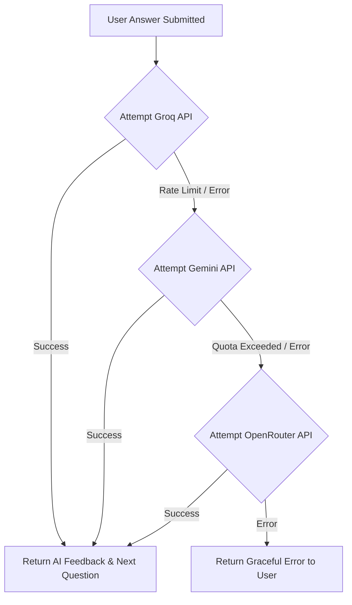

<div align="center">
  <h1>🚀 AscendIQ</h1>
  <p>An AI-powered interview preparation platform that helps students and job seekers master technical interviews.</p>
</div>

---

## 📌 Overview

**AscendIQ** is a comprehensive interview preparation platform designed to help candidates practice, evaluate, and improve their technical and behavioral interview skills. Powered by advanced Generative AI models (Groq, Gemini, OpenRouter), AscendIQ acts as a real-time conversational interviewer, dynamically generating questions and follow-ups based on the user's responses.

Whether you're practicing in **Learning Mode** or simulating a real environment in **Placement Mode**, AscendIQ tracks your readiness, analyzes your weaknesses, and provides actionable feedback to help you succeed.

---

## ✨ Features

### 🔐 Authentication
- **Email Registration & Login**: Secure JWT-based authentication.
- **OTP Verification**: Email-based OTP verification using Nodemailer.
- **Google OAuth**: One-click social login using Google Identity Services.
- **Password Recovery**: Secure password reset flow.

### 🤖 AI Interview Engine
- **Learning Mode**: Topic-based interviews with immediate feedback and hints.
- **Placement Mode**: Strict, company-specific mock interviews without assistance.
- **Dynamic Questions**: Context-aware follow-up questions generated dynamically based on previous answers.
- **AI Conversation Memory**: Contextual understanding of the entire interview session.
- **Multi-Modal Input**: Support for both **Voice** (Speech-to-Text) and **Text** answering.

### 📊 AI Evaluation
- **Readiness Score**: Overall performance metric calculated by the AI.
- **Technical Accuracy & Communication**: Detailed feedback on technical correctness and communication clarity.
- **Strengths & Weaknesses**: Identification of specific improvement areas.
- **Actionable Suggestions**: Step-by-step guidance on how to improve.

### 📈 Dashboard & Analytics
- **Interview History**: Review past interviews, transcripts, and AI feedback.
- **Progress Tracking**: Visualize readiness trends over time.
- **Weakness Tracker**: Auto-aggregates repeated weaknesses across sessions.
- **Goal Setting**: Set and track personalized interview goals.

### ⚙️ Additional Features
- **Multi AI Provider Fallback**: Automatic failover from Groq -> Gemini -> OpenRouter for 100% uptime.
- **Cloud Integration**: Cloudinary integration for avatar and resume uploads.
- **Rate Limiting**: API protection against brute-force attacks and AI abuse.

---

## 🛠️ Tech Stack

### Frontend
- **Framework**: React 18 (Vite)
- **Routing**: React Router DOM v6
- **Styling**: Tailwind CSS
- **State Management**: React Context API
- **Icons**: Lucide React
- **HTTP Client**: Axios

### Backend
- **Runtime**: Node.js
- **Framework**: Express.js
- **Database**: MongoDB (Mongoose)
- **Authentication**: JSON Web Tokens (JWT), Google Auth Library, bcryptjs
- **File Uploads**: Multer, Cloudinary
- **Email**: Nodemailer

### AI & APIs
- **Primary AI**: Groq (Llama-3)
- **Fallback AIs**: Google Gemini, OpenRouter
- **Speech**: Web Speech API (SpeechRecognition & SpeechSynthesis)

---

## 🏗️ System Architecture

```mermaid
graph TD
    Client[User / Browser] -->|HTTP / REST| Frontend[React + Vite Frontend]
    Frontend -->|Axios Requests| Backend[Express.js API]
    
    Backend -->|Read / Write| MongoDB[(MongoDB Atlas)]
    Backend -->|Upload Files| Cloudinary[Cloudinary CDN]
    Backend -->|Send OTPs| SMTP[SMTP Email Server]
    
    subgraph AI Engine
        Backend -->|Primary| Groq[Groq API]
        Groq -- Failover --> Gemini[Google Gemini API]
        Gemini -- Failover --> OpenRouter[OpenRouter API]
    end
    
    AI Engine -->|Analysis & Follow-ups| Backend
    Backend -->|Return Data| Frontend
```

---

## 📂 Project Structure

```text
AscendIQ/
├── backend/                  # Express.js Backend
│   ├── src/
│   │   ├── config/           # Database and Cloudinary configurations
│   │   ├── controllers/      # Route logic and request handling
│   │   ├── middleware/       # JWT auth, rate limiting, and Multer uploads
│   │   ├── models/           # Mongoose schemas (User, Interview, Goal)
│   │   ├── routes/           # Express router definitions
│   │   ├── services/         # Business logic and AI engine integration
│   │   ├── utils/            # Helper functions (e.g., sendEmail)
│   │   ├── app.js            # Express app setup and middleware registration
│   │   └── server.js         # Entry point and server initialization
│   └── package.json
│
└── frontend/                 # React Frontend
    ├── src/
    │   ├── assets/           # Static images and icons
    │   ├── components/       # Reusable UI components (Buttons, Inputs, Modals)
    │   ├── context/          # Global state management (AuthContext)
    │   ├── pages/            # Page components (Dashboard, Interview Room, Login)
    │   ├── routes/           # AppRoutes and Protected/Public route wrappers
    │   ├── services/         # Axios API clients for backend communication
    │   ├── App.jsx           # Main application component
    │   └── main.jsx          # React DOM render entry point
    └── package.json
```

---

## 🚀 Installation

### Prerequisites
- Node.js (v18 or higher)
- MongoDB account (Atlas or local)
- Cloudinary account
- API Keys for Groq, Gemini, or OpenRouter

### 1. Clone the Repository
```bash
git clone https://github.com/yourusername/AscendIQ.git
cd AscendIQ
```

### 2. Backend Setup
```bash
cd backend
npm install
```
Create a `.env` file in the `backend` directory (see [Environment Variables](#-environment-variables)).
```bash
npm run dev
```
The backend will run on `http://localhost:5000`.

### 3. Frontend Setup
```bash
cd ../frontend
npm install
```
Create a `.env` file in the `frontend` directory (see [Environment Variables](#-environment-variables)).
```bash
npm run dev
```
The frontend will run on `http://localhost:5173`.

---

## 🔑 Environment Variables

### Backend (`backend/.env`)

| Variable | Description |
|----------|-------------|
| `NODE_ENV` | Environment mode (`development` or `production`) |
| `PORT` | Port for the Express server (default: `5000`) |
| `MONGODB_URI` | MongoDB connection string |
| `JWT_SECRET` | Secret key for signing JSON Web Tokens |
| `JWT_EXPIRES_IN` | Token expiration time (e.g., `7d`) |
| `FRONTEND_URL` | URL of the frontend for CORS and redirects |
| `GROQ_API_KEY` | API Key for Groq (Primary AI) |
| `GEMINI_API_KEY` | API Key for Google Gemini (Fallback 1) |
| `OPENROUTER_API_KEY` | API Key for OpenRouter (Fallback 2) |
| `GOOGLE_CLIENT_ID` | Client ID for Google OAuth login |
| `SMTP_HOST` | SMTP server host for sending emails |
| `SMTP_PORT` | SMTP server port (usually `465`, `587`, or `2525`) |
| `SMTP_USER` | SMTP username |
| `SMTP_PASS` | SMTP password |
| `CLOUDINARY_CLOUD_NAME`| Cloudinary cloud name for media uploads |
| `CLOUDINARY_API_KEY` | Cloudinary API Key |
| `CLOUDINARY_API_SECRET`| Cloudinary API Secret |

### Frontend (`frontend/.env`)

| Variable | Description |
|----------|-------------|
| `VITE_API_URL` | URL of the backend API (e.g., `http://localhost:5000/api`) |
| `VITE_GOOGLE_CLIENT_ID` | Client ID for Google OAuth login |

*(Note: Do not expose actual secret values in your repository. Use `.env.example` to track required variables.)*

---

## 🧠 AI Provider Architecture

To ensure 100% uptime and high availability during critical interview sessions, AscendIQ implements a robust AI fallback mechanism.



---

## 📡 API Endpoints

### Authentication (`/api/auth`)
| Method | Endpoint | Description |
|--------|----------|-------------|
| `POST` | `/register` | Create a new account and dispatch OTP |
| `POST` | `/login` | Authenticate user and return JWT |
| `POST` | `/google-login` | Authenticate using Google OAuth token |
| `POST` | `/verify-otp` | Verify 6-digit email OTP |
| `POST` | `/resend-otp` | Resend verification OTP |
| `POST` | `/forgot-password`| Request password recovery OTP |
| `POST` | `/reset-password` | Reset password using OTP |
| `GET`  | `/me` | Get current authenticated user profile |

### Interviews (`/api/interviews`)
| Method | Endpoint | Description |
|--------|----------|-------------|
| `POST` | `/session` | Initialize a new interview session |
| `POST` | `/start` | Start the interview and get the first question |
| `GET`  | `/sessions` | Get all interview sessions for the user |
| `GET`  | `/session/:id` | Get details and transcript of a specific session |
| `PATCH`| `/session/:id/status` | Update session status (e.g., completed) |
| `POST` | `/:sessionId/message`| Submit user answer and get AI follow-up |
| `POST` | `/:sessionId/analyze`| Trigger final AI evaluation and scoring |

### Profile (`/api/profile`)
| Method | Endpoint | Description |
|--------|----------|-------------|
| `GET`  | `/me` | Get user profile data and statistics |
| `PUT`  | `/me` | Update user profile information |
| `POST` | `/upload-avatar` | Upload profile picture to Cloudinary |
| `POST` | `/upload-resume` | Upload resume to Cloudinary |

### Goals (`/api/goals`)
| Method | Endpoint | Description |
|--------|----------|-------------|
| `GET`  | `/` | Get all goals for the current user |
| `POST` | `/` | Create a new goal |
| `DELETE`| `/:id` | Delete a specific goal |

---

## 📸 Screenshots

### Landing Page


### Dashboard


### Interview Room


### Final Evaluation & Results


---

## 🚀 Deployment

- **Backend (Render)**: The Node.js/Express API is deployed on Render as a Web Service. Environment variables are managed via the Render dashboard.
- **Frontend (Vercel)**: The React/Vite application is deployed on Vercel. Builds are triggered automatically on pushes to the `main` branch.

---

## 🔮 Future Enhancements

- **Resume Analysis**: Auto-generate personalized interview questions based on the user's uploaded resume.
- **Coding Interviews**: Integrated code editor with live AI evaluation for technical programming rounds.
- **Behavioral Interviews**: Specialized STAR-method behavioral interview tracks.
- **Speech Emotion Analysis**: Analyze voice tone and pacing during the interview for advanced feedback.
- **Leaderboards & Competitions**: Gamified ranking systems for users in similar domains.
- **Interview Replay**: Re-watch and listen to past interviews to self-evaluate body language and tone.

---

## 👨‍💻 Contributors

- Himani Agarwal - *Lead Developer*

*(Feel free to contribute by opening an issue or submitting a pull request!)*

---

## 📄 License

This project is licensed under the MIT License. See the `LICENSE` file for details.
